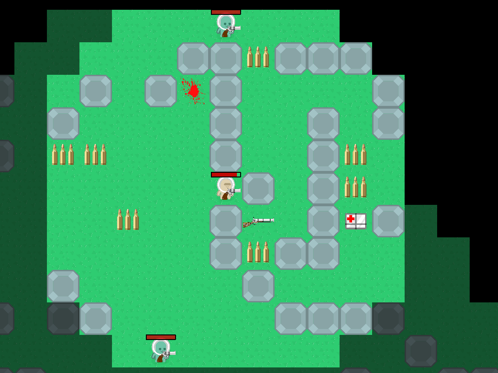

.. _gui:

Application GUI
=======================

WorldMor has a GUI created in the PyQt5 framework.
GUI create simulation over game class using daemon thread for doing time moments in the game.
The time is discrete, but can be very small (0.1 sec for example).
The daemon tick thread also do updates on GUI visualization and update score,
live and bullets in the status bar.

Control
--------

In the GUI, you can create a new game (Ctrl + N), load game (Ctrl + O),
save as game(Ctrl + Shift + S), save to last file use in save as (Ctrl + S).
Next, you can select one of three levels.
Also, there is too possibility switch to fullscreen mode (Alt + Return).
For move on map use arrows or WSAD. For the shoot, you can use space or 0.
You can zoom in and out using (Ctrl + mouse wheel)

Items
-------

On the map, you can find visualized items.
Pharmacies give you some health for the next game,
Bullets are needed for shooting.
Every gun has other damage and takes the other number of bullets.
The items can be taken for the enemy too.
With some probability, you can find on the map some blood which are points (score).
This score is too from killed enemies, but it need be careful enemy can take the blood too.
Bellow are example of items from game.

