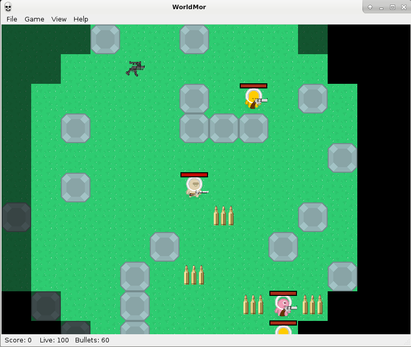

.. WorldMor documentation master file, created by
   sphinx-quickstart on Wed Jan 30 08:27:51 2019.
   You can adapt this file completely to your liking, but it should at least
   contain the root `toctree` directive.

WorldMor's documentation!
====================================

.. toctree::
   :maxdepth: 2
   :caption: Contents:

   game/gui
   game/installation
   game_logic/game
   auto/worldmor_doc
   graphic
   license

Introduction
==================
**WorldMor** is an application (game) write in Python using framework PyQt.
It is created as a semestral work of **MI-PYT** course at **CTU in Prague**.

In this game, it's an effort to get the best score on the map in the selected level.
The map contains the crafts, bullets, weapons, and of course enemies, which is the task of destroying.
The Enemies can also collect these items.
With time when the distance from the start is more significant the count of objects on the map decreasing,
and the number of enemies increasing. The game can also be played in fullscreen mode.
There are three levels of difficulty that are specified by enemy surveillance and their speed.
The game also allows you to save and load the game for the later sequel.

Indices and tables
==================

* :ref:`genindex`
* :ref:`modindex`
* :ref:`search`
